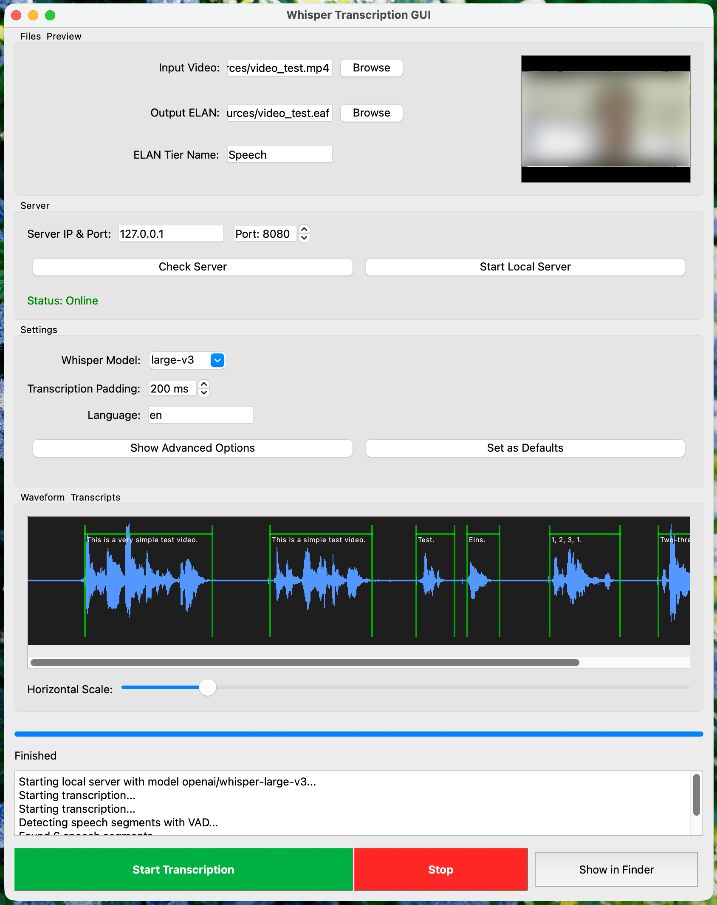
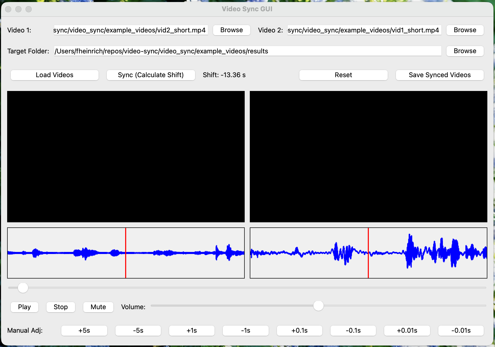

<p align="center">
  
</p>

# Video Helper Tools

Video Helper Tools is a unified suite of desktop and command-line utilities for working with videos and audio.
It combines three workflows into one project:

- **Compress & Archive** — batch-compress videos while preserving important metadata.
- **Sync Videos** — align two recordings using their audio tracks.
- **Transcribe Audio** — generate ELAN annotations from speech using Whisper and VAD.

The main entry point is a PyQt5 application that exposes all three tools in a single tabbed interface.

## Overview

This repository is designed as a practical helper toolkit rather than a single-purpose encoder or transcription app.
It is intended for:

- archiving large video collections,
- comparing original vs. processed video results,
- synchronizing multi-camera recordings,
- and producing transcription data for later manual review in ELAN.

## Features

### Compress & Archive

- Batch video compression with FFmpeg
- Metadata preservation with ExifTool
- Optional hardware acceleration on supported systems
- Automatic handling of cases where the compressed file would be larger than the original
- Support for resolution and frame-rate reduction to save storage
- GUI with live logs, progress display, and side-by-side preview
- Apple Photos compatibility fix for HEVC videos

<p align="center">
  
</p>



### Sync Videos

- Extracts audio from two videos with FFmpeg
- Calculates offset between tracks
- Applies the detected shift to synchronize clips
- Includes a GUI for waveform visualization and preview before saving



### Transcribe Audio

- Uses Whisper-based transcription via a FastAPI server
- Voice Activity Detection with Silero VAD
- Writes results into ELAN `.eaf` files for later annotation
- Supports single-file and batch-style workflows through the GUI
- Can run locally or against a remote server


## Installation

### Python dependencies

Install the Python packages required by the suite:

```bash
pip install -r requirements.txt
```

### External dependencies

Some features rely on system tools that must be installed separately:

- **FFmpeg** / `ffprobe`
- **ExifTool**

Example installation commands:

```bash
# macOS
brew install ffmpeg exiftool

# Ubuntu / Debian
sudo apt update
sudo apt install ffmpeg libimage-exiftool-perl
```

## Running the suite

Start the combined desktop application with:

```bash
python main.py
```

This launches the PyQt5 window with tabs for:

- Compress & Archive
- Sync Videos
- Transcribe Audio

## Transcription workflow

The transcription workflow uses a client/server setup:

1. Start the Whisper FastAPI server.
2. Run the transcription client against a file or folder.
3. Review and correct the generated ELAN output if needed.

Typical commands from the docs include:

```bash
run-whisper-server
```

and then:

```bash
annotate-to-elan --video_path YOURVIDEOFILE
```

If you need to point the client to a different host:

```bash
annotate-to-elan --video_path YOURVIDEOFILE --url YOURHOST --port YOURPORT
```

You can also run the scripts directly if preferred.

## Project structure

The application is organized around a modular package named `video_helper_tools`.

- `main.py` — launches the combined GUI suite
- `video_helper_tools.compressor` — compression and archive workflow
- `video_helper_tools.sync` — audio-based video synchronization workflow
- `video_helper_tools.transcriber` — Whisper transcription and ELAN export workflow
- `docs/` — standalone documentation for each tool
- `example_resoucres/` — sample source media files
- `example_results/` — sample output files

## Example assets

The repository includes sample media and screenshots to help demonstrate the tools:

- `example_resoucres/` contains example videos, audio, and ELAN files
- `example_results/` contains example compressed outputs
- `docs/armadillo-logo.png` is the project logo
- `docs/gui-demo-screenshot.png` shows the transcription GUI
- `docs/sync-gui-demo.png` shows the synchronization GUI

## Requirements

The current Python dependency list includes:

- `PyQt5`
- `FFmpeg` tooling through your system installation
- `numpy`, `librosa`, `matplotlib`
- `pympi-ling`
- `requests`
- `silero_vad`
- `torch`, `torchaudio`
- `fastapi`, `uvicorn`, `transformers`
- `opencv-python`
- `PyQtChart`, `i18n`, `onnxruntime`

## Roadmap

- [x] Combine tools into a single suite
- [ ] Implement batch mode improvements for transcription
- [ ] Automatic subtitle insertion
- [ ] Visual quality vs. file size comparison tools
- [ ] Saveable default settings for each tab

## License

This project is licensed under [CC BY-NC-SA 4.0](https://creativecommons.org/licenses/by-nc-sa/4.0/?ref=chooser-v1).