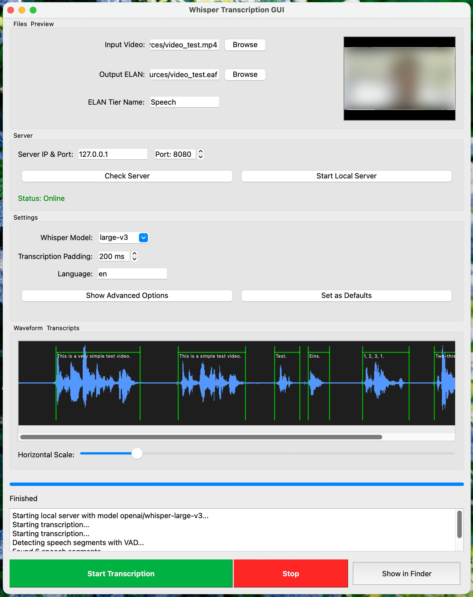

# Video Annotation into ELAN Files with Whisper

The "Transcribe Audio" tool automates the transcription of videos using [OpenAI's Whisper model](https://github.com/openai/whisper). The result is written into an [ELAN](https://archive.mpi.nl/tla/elan) file (via [pympi](https://github.com/dopefishh/pympi)), where it should be checked and corrected manually.

This is not a full-fledged transcription tool but a helper for batch transcription. For real-time transcription, look into [RealtimeSTT](https://github.com/KoljaB/RealtimeSTT).

## How it works

- A [FastAPI](https://fastapi.tiangolo.com/) server runs the Whisper model (via Hugging Face `transformers`, default `openai/whisper-large-v3`).
- The client extracts the audio with `ffmpeg`, finds speech segments with [Silero VAD](https://github.com/snakers4/silero-vad), and sends each segment to the server (via [requests](https://pypi.org/project/requests/)).
- The transcribed segments are written as annotations into an ELAN file next to the video.

Running Whisper on a CPU works but is (really!) slow. The recommended setup is a machine with a strong GPU running the server, with clients connecting over the network. It was tested with an NVIDIA RTX 4070 Ti (12 GB VRAM) and an RTX 5080 (16 GB VRAM); plan for at least 8 GB VRAM for `large-v3`. Quantized or distilled models reduce memory at a small quality cost. The server prints the device it uses: `cuda`/`cuda:0` means GPU, `cpu` means it will be slow. On macOS the Apple `mps` backend is used when available (not extensively tested).

## Installation

`ffmpeg` must be installed on the system (`brew install ffmpeg` / `sudo apt install ffmpeg`). Python dependencies are managed with [uv](https://docs.astral.sh/uv/):

```bash
uv sync
```

## Run

### Start the server

```bash
uv run run-whisper-server
```

This listens on `127.0.0.1:8080` by default, so only local clients can connect. To serve other machines, bind to a reachable host:

```bash
uv run run-whisper-server --url YOURHOST --port YOURPORT
```

On Linux, `video_helper_tools/transcriber/launch_scripts/` contains a shell script and a `.desktop` entry to start the server via a desktop shortcut; adjust the `/PATH/TO/...` placeholders in the `.desktop` file.

### Transcribe from the command line

In a second terminal:

```bash
uv run annotate-to-elan --video_path YOURVIDEOFILE
```

If the server runs on another machine:

```bash
uv run annotate-to-elan --video_path YOURVIDEOFILE --url YOURHOST --port YOURPORT
```

The port can usually be omitted. Run `uv run annotate-to-elan --help` for VAD and padding options.

### GUI

Start the suite and choose **Transcribe Audio** on the landing page:

```bash
uv run main.py
```

The GUI lets you configure the server, start a local server, and transcribe in two modes:
- **Single file:** select a video, see its audio waveform, and follow the transcription progress live.
- **Batch mode:** select a folder and transcribe all videos in it sequentially, with per-file progress and quick access to the generated ELAN files.



## Ideas

- A desktop entry for `annotate-to-elan`.
- A Docker image for the server (with GPU support) so it runs on any machine with Docker.
