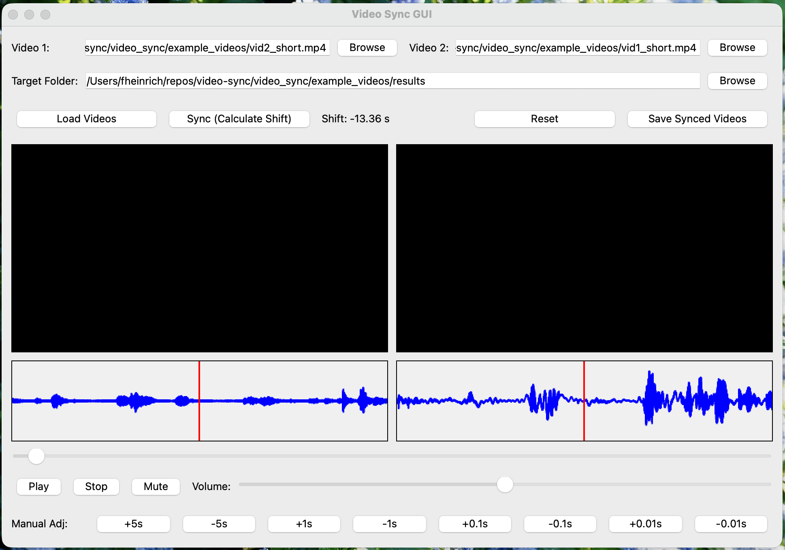

# Video Synchronization Tool

The "Sync Videos" tool aligns two recordings of the same event (e.g. two camera angles, or a screen recording and a camera clip). It extracts the audio of both videos with `ffmpeg`, computes the offset between the audio tracks, and trims one video so both start in sync.

## Installation

`ffmpeg` must be installed on the system:

```bash
brew install ffmpeg        # macOS
sudo apt install ffmpeg    # Ubuntu/Debian
```

Python dependencies are managed with [uv](https://docs.astral.sh/uv/) (see the main README):

```bash
uv sync
```

## Usage

Start the suite and choose **Sync Videos** on the landing page:

```bash
uv run main.py
```

The GUI shows the waveforms of both videos, calculates the shift, and lets you preview both videos playing in sync (with scrubbing, volume and mute) before saving the synchronized files to a target folder.



The sync logic can also be used from Python:

```python
from video_helper_tools.sync.video_synch import sync_videos
sync_videos(path_to_video_1, path_to_video_2)  # pathlib.Path objects
```

This writes the synchronized videos into a `results/` folder next to the first video.

Sample videos are provided in `example_resources/`.

## Notes

This has been tested with short videos (about two minutes each); longer videos and larger delays need further testing.
